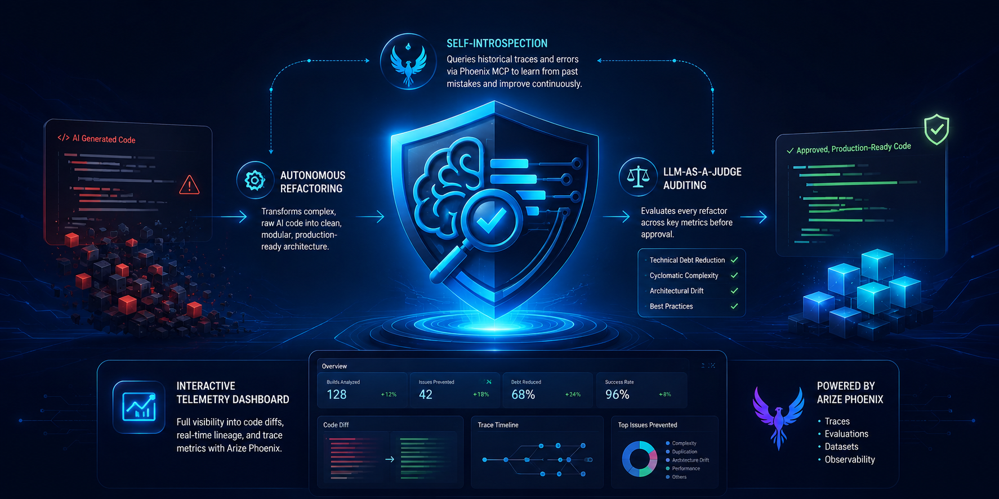

<div align="center">



<br/>
<br/>


# Cenli — Dev Clarifier AI

**The autonomous DPE guardrail agent that intercepts, refactors, and gates AI-generated code before it hits main.**

[](https://cenli-dpe-backend-183690574774.europe-west2.run.app/api/pipeline/status)
[](LICENSE)
[](https://arize.com)
[](https://ai.google.dev)

</div>

---

## The Problem

In 2026, the bottleneck in software engineering is no longer writing code — it's **validating it**.

Generative AI tools let developers output massive volumes of code instantly. But this velocity creates a critical challenge: an unprecedented accumulation of technical debt, architectural complexity, and verification overhead. Monolithic, unoptimised AI code gets committed straight into repositories, creating silent performance issues, structural fragmentation, and code duplication that manual reviews can't keep up with.

---

## The Solution

**Cenli** is an autonomous Developer Productivity Engineering (DPE) Guardrail Agent that acts as an intelligent gatekeeper for AI-generated code.

```
AI Agent Commit
      │
      ▼
┌─────────────────────────────────────────────────────┐
│              Cenli DPE Pipeline                     │
│                                                     │
│  1. INGEST      Read raw source code                │
│  2. INTROSPECT  Query own Phoenix traces via MCP    │
│  3. REFACTOR    Gemini rewrites into clean modules  │
│  4. LINT        black + flake8 CI gate              │
│  5. JUDGE       LLM-as-a-Judge structured eval      │
│  6. ANNOTATE    Scores written back to Phoenix      │
└─────────────────────────────────────────────────────┘
      │
      ▼
Approved to Main  OR  Rejected + Re-evaluate
```

### Key Capabilities

| Feature | Description |
|---------|-------------|
| **Autonomous Refactoring** | Intercepts raw AI code and rewrites it into clean, modular, production-ready architecture |
| **Self-Introspection via Phoenix MCP** | Queries its own historical execution traces at runtime to learn from past failures and calibrate refactor strategy |
| **LLM-as-a-Judge Auditing** | Structured JSON evaluation across Technical Debt, Cyclomatic Complexity, Architectural Drift, and Modularity |
| **Full Observability** | Every LLM call traced via OpenInference → Arize Phoenix with BatchSpanProcessor for zero-blocking production exports |
| **Interactive Dashboard** | Real-time pipeline feed, diff viewer, trace waterfall, and eval panels built with React + TanStack |

---

## Architecture

```
┌─────────────────────────────────────────────────────────────┐
│                    Cenli DPE Stack                          │
├──────────────────┬──────────────────────────────────────────┤
│   Frontend       │  TanStack Start · React 19 · Tailwind v4 │
│   (Lovable)      │  Pipeline Feed · Diff Panel · TraceView  │
├──────────────────┼──────────────────────────────────────────┤
│   Backend        │  FastAPI · Python 3.12 · Cloud Run       │
│   Agent          │  google-genai SDK · Gemini 2.5 Flash     │
├──────────────────┼──────────────────────────────────────────┤
│   Observability  │  Arize Phoenix · OpenInference OTLP      │
│                  │  BatchSpanProcessor · eval.* annotations │
├──────────────────┼──────────────────────────────────────────┤
│   MCP            │  @arizeai/phoenix-mcp · npx subprocess   │
│                  │  Runtime self-introspection tool calls    │
└──────────────────┴──────────────────────────────────────────┘
```

---

## Hackathon Track

**Arize — Build Gemini Agents with Full Observability and Self-Introspection via MCP**

| Criterion | Implementation |
|-----------|---------------|
| Code-owned agent runtime | `google-genai` SDK — direct `generate_content` calls, not Agent Builder |
| OpenInference instrumentation | Manual OTel spans with `openinference.span.kind=LLM`, token counts, model names |
| Phoenix Cloud / self-hosted | Env-switched: `PHOENIX_API_KEY` set → Cloud, blank → local Docker |
| Phoenix MCP as live runtime tool | `PhoenixMCPClient` spawns `@arizeai/phoenix-mcp` subprocess, does JSON-RPC handshake, exposes real tools to Gemini |
| LLM-as-a-Judge evaluations | `validator.py` with `response_schema` + `response_mime_type="application/json"`, temp=0.1, 4-attempt retry |
| Eval scores logged to Phoenix | `_annotate_span_with_evaluation()` writes `eval.*` attributes onto active span |
| Self-improvement loop | Stage 2 queries `eval.verdict` + `eval.technical_debt_reduction_pct` from prior spans to calibrate refactor depth |

---

## Live Endpoints

Base URL: `https://cenli-dpe-backend-183690574774.europe-west2.run.app`

| Method | Path | Description |
|--------|------|-------------|
| `GET` | `/api/pipeline/status` | Health check |
| `POST` | `/api/pipeline/submit` | Full DPE pipeline `{filename, code}` |
| `POST` | `/api/pipeline/upload` | File upload pipeline |
| `POST` | `/api/evaluate` | Direct LLM-as-a-Judge `{original, refactored}` |
| `GET` | `/api/traces` | Phoenix traces proxy |

**Quick test:**
```bash
curl -X POST https://cenli-dpe-backend-183690574774.europe-west2.run.app/api/evaluate \
  -H "Content-Type: application/json" \
  -d '{
    "original": "def f(x):\n  if x>0:\n    return x*2\n  return 0",
    "refactored": "def double_positive(x: int) -> int:\n    return x * 2 if x > 0 else 0"
  }'
```

---

## Local Development

### Prerequisites
- Python 3.11+
- Node.js 18+ (for Phoenix MCP via `npx`)
- Gemini API key from [AI Studio](https://aistudio.google.com/apikey)
- Arize Phoenix (Cloud or local Docker)

### Backend

```bash
cd backend
python -m venv .venv && source .venv/bin/activate
pip install -r requirements.txt
cp .env.example .env   # add GEMINI_API_KEY + PHOENIX_API_KEY
uvicorn src.server:app --reload --port 8000
```

### Frontend

```bash
cd frontend
bun install
bun dev
```

### Phoenix (local Docker)

```bash
docker run -p 6006:6006 arizephoenix/phoenix:latest
# Dashboard → http://localhost:6006
```

---

## Project Structure

```
Cenli/
├── banner.png                  # Project banner
├── frontend/                   # TanStack Start React dashboard
│   └── src/
│       ├── components/dpe/     # Pipeline Feed, Diff Panel, Trace View, Eval Panel
│       ├── routes/             # Dashboard, Agents, Telemetry, Evaluations, Policies
│       └── lib/                # Auth, DPE data types, API client
└── backend/                    # FastAPI DPE agent
    ├── src/
    │   ├── agent.py            # Core orchestration loop (6 stages)
    │   ├── server.py           # FastAPI HTTP + Phoenix proxy routes
    │   ├── mcp_client.py       # Phoenix MCP subprocess client
    │   └── tools/
    │       ├── code_io.py      # File read/write/lint tools
    │       └── validator.py    # LLM-as-a-Judge with response_schema
    ├── mcp_config.json         # Phoenix MCP server config
    ├── Dockerfile              # Cloud Run container
    └── .env.example            # Environment variable template
```

---

## Environment Variables

| Variable | Required | Description |
|----------|----------|-------------|
| `GEMINI_API_KEY` | ✅ | [AI Studio](https://aistudio.google.com/apikey) |
| `PHOENIX_API_KEY` | Cloud only | [app.phoenix.arize.com](https://app.phoenix.arize.com) → Settings → API Keys |
| `PHOENIX_COLLECTOR_ENDPOINT` | ❌ | Auto-set from `PHOENIX_API_KEY` |
| `GOOGLE_CLOUD_PROJECT` | Deploy only | GCP project for Cloud Run |

---

<div align="center">

Built for the **Arize × Google Gemini Hackathon 2026**

*Ship AI-generated code without the debt.*

</div>
